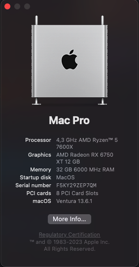

# HACKINTOSH MSI-MAG-MORTAR-B650M-7600X-RX6750XT

**OpenCore : 0.9.6**

**macOS ：13.6.1**

**SMBIOS : MacPro7,1**

### Specification

| **Component**    | **Model**                  |
| ---------------- | -------------------------- |
| CPU              | AMD Ryzen 5 7600X               |
| Motherboard      | MSI(MAG) B650M MORTAR WIFI (BIOS 7D76vA8) |
| RAM              | XPG 32GB(16GB×2) DDR5 6000Mhz |
| Audio Chipset    | ALC4080 Codec                  |
| GPU              | XFX RX 6750XT 12GB              |
| Ethernet         | RTL8125B 2.5Gbps LAN            |
| WiFi & Bluetooth | AMD Wi-Fi 6E         |
| OS Disk(nvme)    | NVME XPG Gen4 1TB            |

### Bios Setup

Based on Load Optimize defaults

- TMP (Disable)
- Secure Boot (Disable)
- 4G Decoding (Disable)
- Change to CSM mode

More Info: [AMD BIOS Settings](https://dortania.github.io/OpenCore-Install-Guide/AMD/zen.html#amd-bios-settings)

### What works

- Audio
- Ethernet
- USB  
  ***If you have USB problems, You can use it to generate your own usb configuration information***
- Wi-Fi
- Bluetooth